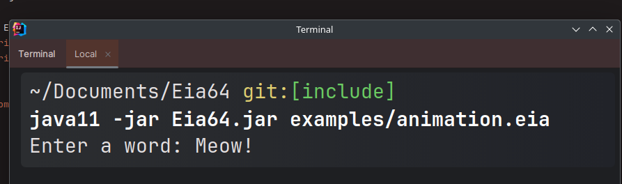
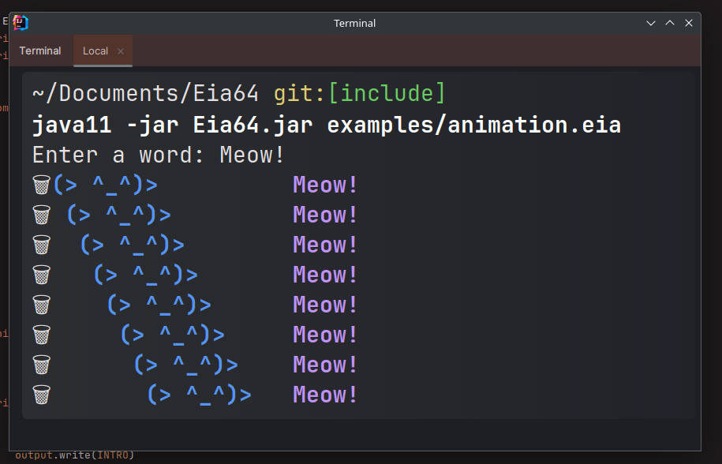
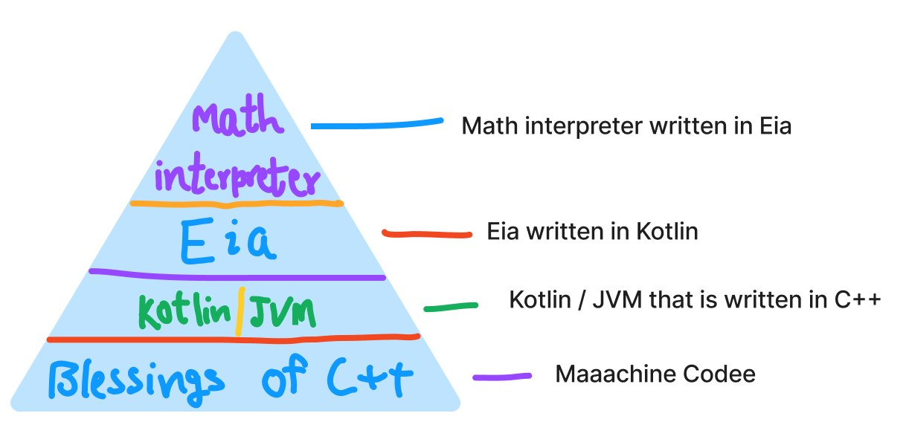
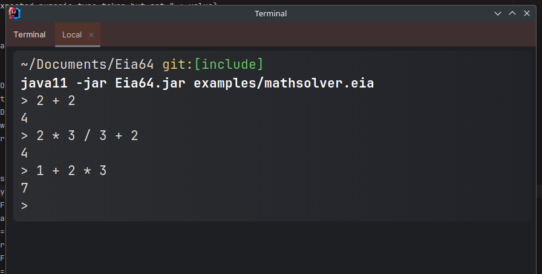

Some fascinating stuff written in Eia. 💪

To try out all the examples yourself, just clone the repository:

```bash
git clone https://github.com/XomaDev/Eia64
cd Eia64
```

Eia requires a minimum version of Java 11 to run.

### Trash Guy Animation

```bash
java -jar Eia64.jar examples/animation.eia
```

[View source code](https://github.com/XomaDev/Eia64/blob/include/examples/animation.eia).
He asks you for a text:



But don't be kind! If you give it to him, he will steal it! 😭



### Math solver

What about a simple math interpreter written in an interpreted language Eia which is written in JVM language Kotlin which is powered by C++? 🥰



Eia64 is written in Kotlin, which is a JVM Language. JVM Languages don't convert source code directly into machine code,
they produce custom Bytecode instructions that are then executed by the Java Virtual Machine. JVM is implemented in C++.

Right now, the math interpreter can perform basic arithmetic operations (`+` `-` `/` `*`) with operators `*` and `/` having
higher priority.

```bash
java -jar Eia64.jar examples/mathsolver.eia
```



Note that the math interpreter doesn't utilize `Float` type, so doing floating point division or multiplication will round of the result.