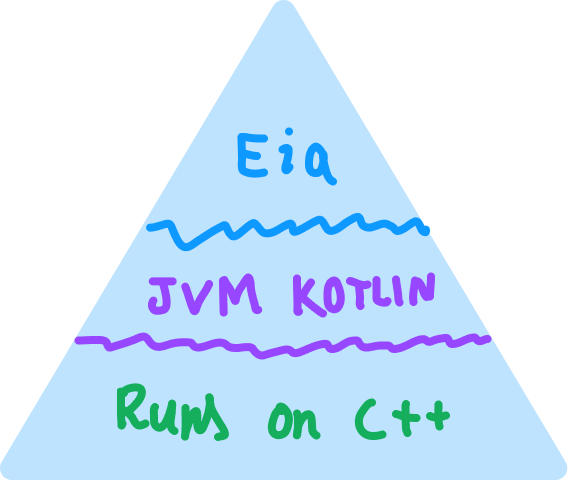

# Project Eia
 
Ever since I was 12–13, I've loved interpreters!
One of my friends recommended the book [Crafting Interpreters](https://craftinginterpreters.com/)
by Robert Nystrom which taught me basic foundational ideas and mechanics of an interpreter.
Even before I discovered this book,
I had spent a lot of days creating interpreters (which where not so good, but fun!)

## How does Eia work

Eia is written in Kotlin, a JVM Language.
Kotlin compiles down into Bytecode that is later executed by the Java Virtual
Machine (JVM).\
JVM is written in C++.
So when you write code in Eia, there are three layers of abstraction the code has to go through to get executed.

Originally part of <b>`lang-jam`</b> hosted by HackClub!
Also part of Arcade <b>\<3</b>, that gave me an immense boost of
productivity and long dedication required.

This website aims to document all the features and working of Eia64!