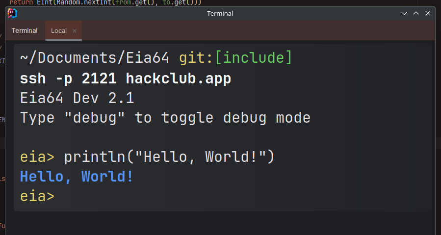

# Quick start

You can get your hands on Eia in just a few seconds!

```bash copy
git clone https://github.com/XomaDev/Eia64
cd Eia64 && java -jar Eia64.jar
```

> Requires a minimum of Java 11 to be installed on your system.

And you have a fully interactive shell:


<br></br>

# You lazy?

We've got you covered!
If you are scared of Git, then you can try out our SSH version.\
You don't need to do anything, just fire up your favorite terminal and paste a line.

```bash copy
ssh -p 2121 hackclub.app
```

And Tada! You can experience Eia without installing it! How cool is that!



Got this idea from [zachlatta/sshtron](https://github.com/zachlatta/sshtron) or I never would have known this was possible lol.
How does it work? It was really easy to implement it (<small>a lie</small>). I just had to spawn an SSH server, and write some
custom I/O code to suit Eia. Previously a version was using raw servers, netcat was used to do the same. But SSH is better
in so many ways, gives total control of everything that I need.

## Command line

Going into a little bit of depth, if you are using Eia the <i>Git</i> way.

```bash
java -jar Eia64.jar live|source_file [debug=true] [pipe=/tmp/pipe1]
```

Enabling debug mode will print all the lexed tokens, parsed nodes, and enable tracer.

### Piping

Eia has a special ability where you can actually SEE what's happening live.
For e.g., if a function was called with some args, it will be displayed in the logs.

This works (<i>tested</i>) on linux.

To use this feature, first create a linux pipe:

```bash
mkfifo /tmp/pipe1
```

It's like a channel where Eia will send out live runtime or parse-time logs.\
After that:

```bash
cat /tmp/pipe1
```

> Note that if you enable piping, it will require you to run the cat command beforehand running Eia