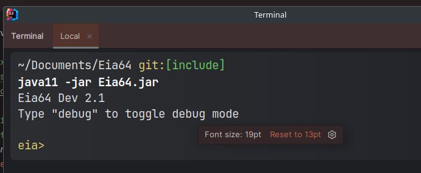

# Quick start

You can get your hands on Eia in just a few seconds!

```bash copy
git clone https://github.com/XomaDev/Eia64
cd Eia64 && java -jar Eia64.jar
```

> Requires a minimum of Java 11 to be installed on your system.

And you have a fully interactive shell:



<br></br>

# You lazy?

We've got you covered! If you are scared of Git, then you can try out our SSH version

